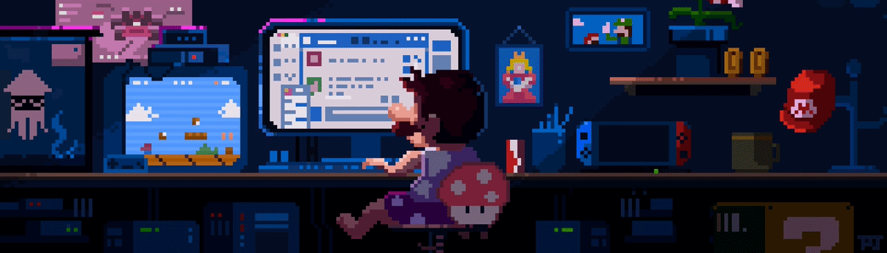

  

  

---

### 🔮 Sobre Mim

Sou um desenvolvedor focado em **Backend**, construindo a lógica e a estrutura que fazem o mundo digital girar. Da automação com hardware à arquitetura de APIs, busco sempre a solução mais eficiente e elegante.

- 🔭 **Atualmente:** Mergulhando fundo no ecossistema **Python/Flask** e APIs RESTful.
- 🌱 **Aprendendo:** Novas formas de otimizar a comunicação entre serviços e segurança de dados.
- 🎮 **Hobby:** Desenvolvendo mundos no Roblox usando **Lua**.
- 🤖 **Maker:** Criando projetos de IoT com **Arduino (C/C++)**.

---

### 🎓 Formação & Comunidade

- 🎖️ **Técnico em ADS (Integrado ao Ensino Médio):** Concluído com a honra de **Aluno Laureado** (Primeiro Lugar Geral).
- 🏫 **Bacharelado em Sistemas de Informação:** Graduando (Atualmente no 1° Período).
- 🚀 **Desenvolvimento Backend:** Aperfeiçoando conceitos de arquitetura e código através da plataforma **Alura**.
- 📍 **Ecossistema Tech (Recife):** Presença ativa em meetups, hackathons e eventos de tecnologia da região.

---

### 🛠️ Tech Stack

  
  
  
  

  
  
  
  

---

### 🚀 Projetos em Destaque

Aqui estão os projetos principais onde aplico minha lógica de programação, arquitetura e desenvolvimento de sistemas:

| Projeto | Descrição | Tech Stack | Link |
| :--- | :--- | :--- | :--- |
| **🔌 PlugPilot** | Projeto desenvolvido em grupo para a faculdade, focado na arquitetura e gerenciamento de soluções backend. | `Python`, `Flask` | [Ver Repositório](https://github.com/AMSDAF/PlugPilot) |
| **🏰 Base Defense Strategy** | Jogo de estratégia desenvolvido para a plataforma Roblox, aplicando conceitos avançados de lógica e scripts. | `Lua`, `Roblox` | [Ver Repositório](https://github.com/AMSDAF/Base-Defense-Strategy) |

---

### 📊 Estatísticas & Linguagens

  
  

  

---

### 📬 Conecte-se Comigo

Aqui estão os canais oficiais para trocar uma ideia sobre APIs, desenvolvimento de jogos, automação ou oportunidades:

| Canal de Contato | Link Direto | Horário Ativo |
| :--- | :--- | :--- |
| **💼 LinkedIn Profissional** |  | Comercial |
| **📧 E-mail para Projetos** |  | 24/7 |

---

  <i>"Talk is cheap. Show me the code." — Linus Torvalds</i>  
  Construído por Antônio Marcos

